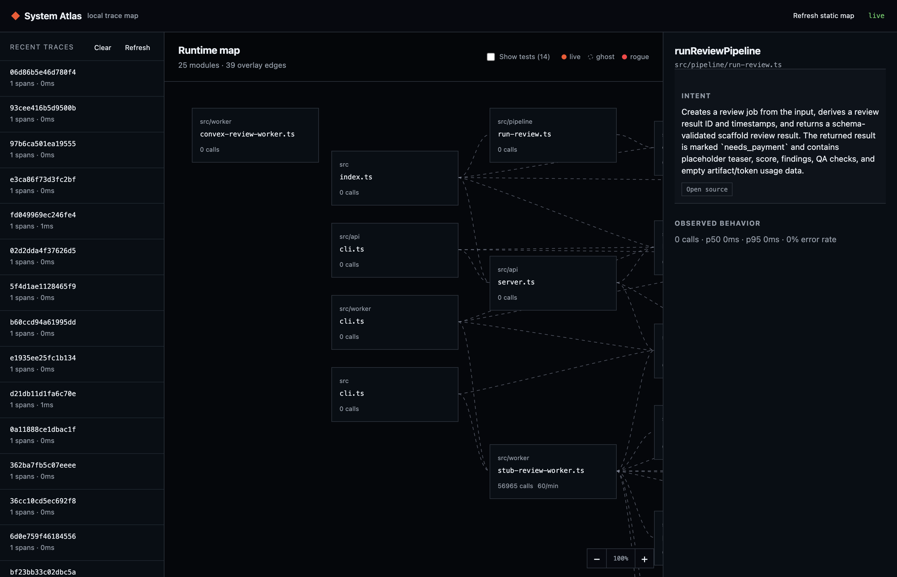

# System Atlas

Local-only observability for TypeScript Node projects. It instruments exported functions at module load, stores spans in `.atlas/atlas.db`, and provides a live browser graph at `127.0.0.1`.



## Requirements

- Node 20.6 or later
- A TypeScript runner or transpilation setup that can compose with Node module hooks (the included demo uses `tsx`)

## Try the demo

```sh
npm install
npm run demo:install
npm run demo:app
# in another terminal
npm run demo:atlas
```

Open http://127.0.0.1:4400, then request http://127.0.0.1:4310/invoice/demo.

The measured local overhead for the included demo is 2.26%; see [the benchmark record](docs/BENCHMARK.md).

Loader ordering is intentional: put the TypeScript loader first and Atlas second, so Atlas sees emitted JavaScript. The repository includes a loader-chain fixture covering tsx, transpiled ESM under plain Node, and ts-node/esm.

## In a target project

```sh
npm i -D @system-atlas/register @system-atlas/server
```

```json
{
  "scripts": {
    "dev": "node --enable-source-maps --import tsx --import @system-atlas/register ./src/main.ts"
  }
}
```

Start the inspector separately with `npx atlas`. Atlas never starts when `NODE_ENV=production`; it reports the misconfiguration to stderr and leaves the target app uninstrumented.

The default database is `.atlas/atlas.db`, is local-only, and may be deleted to reset all collected state.

## AI debugging and verification

Atlas exposes a read-only JSON diagnostic command for agents and shell workflows:

```sh
npx atlas diagnose --project . --since 10m
npx atlas diagnose trace <trace-id> --project . --include-source
npx atlas diagnose function --project . --module src/invoice.ts --fn createInvoice --since 1h --include-source
npx atlas diagnose verify --project . --since 5m --expect 'src/invoice.ts#createInvoice'
```

Overview reports include recent traces, error groups, hot and slow functions, and rogue or unobserved static edges. `--include-source` resolves observed functions to their exact file, definition line, source hash, and implementation. Trace arguments and results are hidden unless `--include-values` is explicitly supplied. Verification exits with status `2` when no spans were observed, an expected function was absent, or an error was recorded.

The versioned Codex skill lives in [`skills/atlas-debug`](skills/atlas-debug). It drives the real app in a browser, correlates the interaction with a trace, expands the decisive functions into repository code and tests, and repeats the browser flow plus runtime verification after a fix. Install or link that directory into `~/.codex/skills/atlas-debug` to make `$atlas-debug` available across projects.

## Configuration

`atlas.config.ts`, `.js`, or `.json` is optional. Atlas will run with no configuration; this is useful when generated code or sensitive values require a narrower scope.

```ts
export default {
  include: ["src/**"],
  exclude: ["src/generated/**"],
  capture: "values", // or "shapes"
  redact: [/customerNumber/i],
  dbPath: ".atlas/atlas.db",
  retentionHours: 24,
  llm: {
    url: process.env.ATLAS_LLM_URL,
    key: process.env.ATLAS_LLM_KEY,
    model: process.env.ATLAS_LLM_MODEL,
  },
};
```

Captured values are JSON-safe, redact keys matching `token`, `secret`, `password`, `authorization`, or `apikey` by default, and cap each field at 4 KB. If an exported HTTP handler receives a valid W3C `traceparent` header, its trace ID is adopted.

## Descriptions

Descriptions are optional. Atlas first uses `ATLAS_LLM_URL` and `ATLAS_LLM_KEY` (or the `llm` object in the Atlas config) when configured. Otherwise, it automatically detects an authenticated Codex CLI and lets Codex reuse its file-based login from `$CODEX_HOME/auth.json` (normally `~/.codex/auth.json`). Atlas never copies the token into the browser or its database; Codex owns token refresh and the model request. Descriptions are cached by function source hash; use `npx atlas describe` to generate descriptions for all observed functions.

## Current v0.1 boundary

This repository implements the v0.1 server scope: exported function/class-method tracing for ESM and CommonJS, SQLite buffering, live server polling, static/runtime overlays, source-hashed descriptions, and a local graph workspace. Browser tracing, worker trace propagation, and in-process HMR remain future work.
